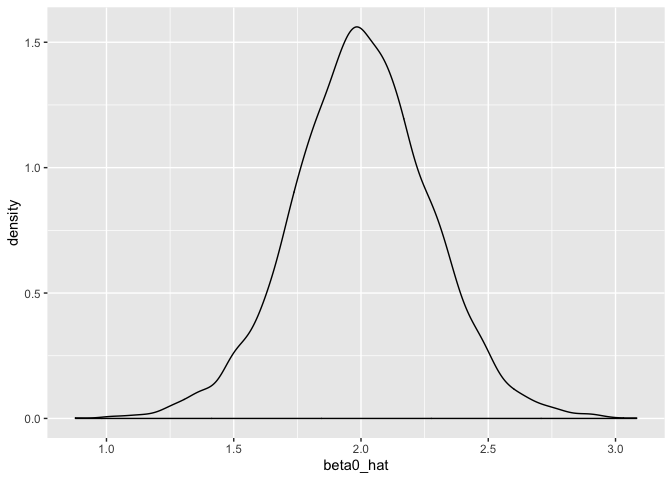

Simulation
================
October 31, 2019

re-use the function from function lecture

``` r
sim_regression = function(n, beta0 = 2, beta1 = 3) {
  
  sim_data = tibble(
    x = rnorm(n, mean = 1, sd = 1),
    y = beta0 + beta1 * x + rnorm(n, 0, 1)
  )
  
  ls_fit = lm(y ~ x, data = sim_data)
  
  tibble(
    beta0_hat = coef(ls_fit)[1],
    beta1_hat = coef(ls_fit)[2]
  )
}
```

we already running a simulation every time we run this line of code

``` r
sim_regression(n = 30)
```

    ## # A tibble: 1 x 2
    ##   beta0_hat beta1_hat
    ##       <dbl>     <dbl>
    ## 1      2.09      3.04

## rerun using a for loop

``` r
output = vector("list", length = 5000)

for (i in 1:5000) {
  
  output[[i]] = sim_regression(n = 30)
  
}

bind_rows(output) %>%
  ggplot(aes(x = beta0_hat)) +
  geom_density()
```

<!-- -->
